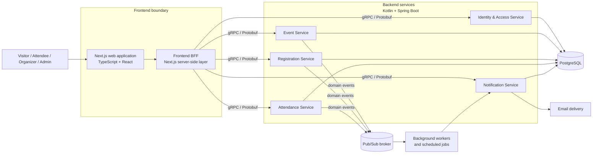
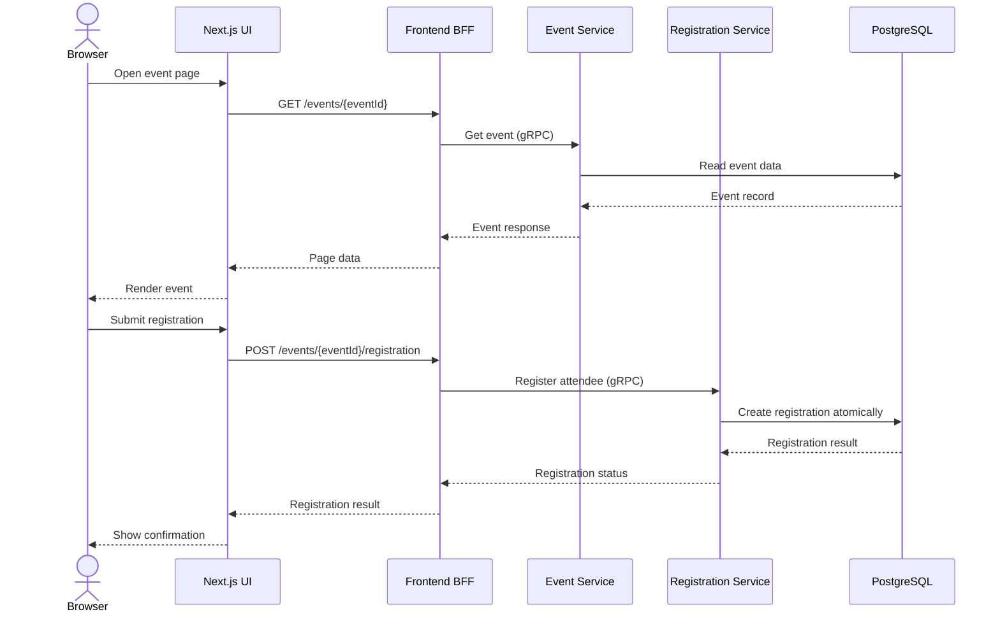
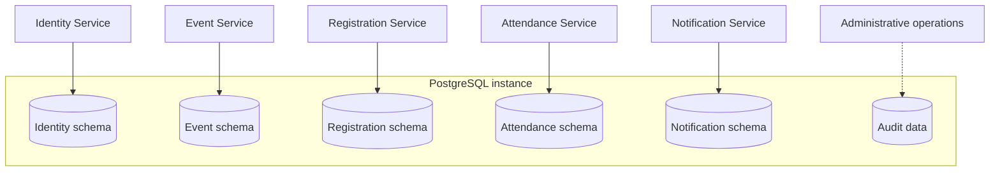
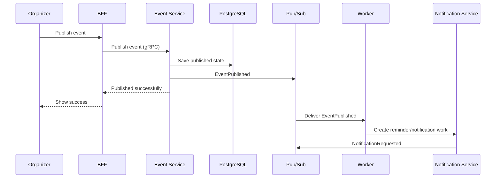

# RVCE Events — High-Level System Design (Draft)

> Status: Draft
>
> This document defines the initial service boundaries and major interactions. Detailed RPC methods, Protocol Buffer messages, database tables, and deployment manifests are intentionally deferred to service-specific design documents.

## 1. Goals

The system should provide a self-hosted platform for discovering, publishing, registering for, and attending RVCE events.

The design uses:

- A TypeScript/Next.js web frontend.
- A frontend Backend-for-Frontend (BFF).
- Kotlin/JVM Spring backend services.
- gRPC and Protocol Buffers for backend service contracts.
- PostgreSQL for durable relational data.
- Asynchronous Pub/Sub messaging for background work.
- Gradle Kotlin DSL for JVM backend builds.
- Liquibase for database migrations.

The design is deployment-neutral and does not require Kubernetes, Helm, Terraform, Cloudflare Workers, or a cloud provider.

## 2. High-level architecture



## 3. Request flow

The browser communicates with the BFF over browser-friendly HTTP. The BFF is responsible for translating browser requests into backend gRPC calls and composing responses where a page needs data from multiple services.



## 4. Service boundaries

### 4.1 Frontend web application

Technology: TypeScript, React, Next.js.

Responsibilities:

- Render public and authenticated user interfaces.
- Provide event browsing, event details, registration, organizer, and admin screens.
- Manage browser state and form interactions.
- Call the BFF rather than calling backend gRPC services directly.
- Handle loading, validation, errors, and accessibility concerns.

The frontend should not contain business rules that must be trusted for authorization, registration capacity, event publication, or attendance.

### 4.2 Frontend BFF

Technology: Next.js server-side code in TypeScript. It may initially live within the frontend application while remaining a clear architectural boundary.

Responsibilities:

- Expose browser-facing HTTP endpoints or server actions.
- Authenticate browser sessions and forward trusted identity context.
- Authorize frontend operations at the edge of the application where useful; backend services remain the final authorization authority.
- Translate frontend request/response models into gRPC client calls.
- Aggregate data from multiple backend services for page-oriented responses.
- Normalize errors into frontend-safe responses.
- Avoid owning durable business data.

The BFF should remain thin. Domain workflows and invariants belong in the Kotlin services.

### 4.3 Identity & Access Service

Responsibilities:

- User identity and account lifecycle.
- Authentication integration.
- Roles and permissions.
- Organizer approval and account status.
- Current-user profile data.
- Authorization information used by other services.

The service owns identity and access data. Other services may store user identifiers and denormalized display information, but should not own authentication credentials or role assignments.

### 4.4 Event Service

Responsibilities:

- Event drafts and event lifecycle.
- Event metadata, schedules, venues, categories, and tags.
- Organizer ownership.
- Submission and administrator approval workflow.
- Publication, cancellation, and archival.
- Public event discovery, filtering, and search.
- Featured event configuration.

The service owns event content and publication state. Registration-specific state remains in the Registration Service.

### 4.5 Registration Service

Responsibilities:

- Registration and cancellation.
- Capacity enforcement.
- Duplicate registration prevention.
- Waitlist ordering and promotion.
- Registration deadlines and eligibility checks.
- Attendee-facing registration status.
- Organizer-facing attendee lists.

Registration creation must be transactional and safe under concurrent requests. The service owns registration and waitlist data.

### 4.6 Attendance Service

Responsibilities:

- Registration-code or QR-based check-in.
- Manual organizer check-in.
- Present, absent, and check-in timestamps.
- Attendance corrections according to permissions.
- Attendance summaries.
- Post-event attendance eligibility for feedback or certificates.

The service owns check-in and attendance records. It verifies registration status through a service call or a versioned event-driven projection.

### 4.7 Notification Service

Responsibilities:

- Notification templates and delivery preferences.
- Email notification requests.
- Registration confirmations and cancellations.
- Event approval, change, and cancellation notifications.
- Event reminders.
- Delivery status and retry handling.

The service consumes domain events and should not make the main event or registration request wait for email delivery.

### 4.8 Workers and scheduled jobs

Workers are background processes associated with the relevant service or with a shared worker runtime.

Responsibilities include:

- Consuming Pub/Sub messages.
- Sending notifications.
- Promoting waitlisted attendees.
- Sending scheduled event reminders.
- Rebuilding projections or search indexes if introduced later.
- Retrying transient failures.
- Running periodic cleanup or reconciliation jobs.

Every background operation should be idempotent, retryable, and observable.

## 5. Data architecture

PostgreSQL is the initial durable datastore. All services may use the same PostgreSQL server and deployment, while ownership remains separated logically by service schema or clearly owned table set.



Rules:

- Each service owns its schema and migrations.
- Services must not directly query another service's tables.
- Cross-service data is accessed through gRPC or asynchronous projections.
- Liquibase changesets should be grouped by owning service.
- JPA/Spring Data is the default persistence approach.
- Native SQL is allowed for complex, performance-sensitive, or PostgreSQL-specific queries.
- A later deployment may split schemas across database instances without changing service ownership contracts.

For the first implementation, a single PostgreSQL instance is simpler operationally. Separate physical databases are an optimization and isolation choice, not an initial requirement.

## 6. Synchronous and asynchronous communication

### Synchronous communication

Use gRPC with Protocol Buffers when the caller needs an immediate result, such as:

- Loading event details.
- Checking the current user's permissions.
- Creating a registration.
- Fetching an organizer's attendee list.
- Performing a check-in.

### Asynchronous communication

Use Pub/Sub when work can happen after the request or when multiple consumers may react to a domain event, such as:

- Event published.
- Event changed or cancelled.
- Registration created or cancelled.
- Attendee promoted from a waitlist.
- Attendance recorded.



The exact broker implementation is intentionally not fixed in this document. The application should depend on a small messaging abstraction so that the self-hosted broker can be selected separately.

## 7. Authorization model

Authorization is enforced in the backend services, not only in the BFF.

- Public users can access published public event data.
- Attendees can manage their own profile and registrations.
- Organizers can manage events they own or are assigned to.
- Administrators can moderate events and manage platform configuration.
- Attendee personal data is only returned to authorized organizers and administrators.
- Service-to-service calls use authenticated service identity and request context.

The initial role model should be role-based. Fine-grained permissions can be introduced when organizer groups and delegated administration require them.

## 8. Main business flows

### Event publication

1. Organizer creates a draft through the BFF.
2. Event Service validates and stores the draft.
3. Organizer submits the draft for approval.
4. Administrator reviews and approves or rejects it.
5. Event Service publishes the event and emits an event-published message.
6. Notification workers process any required notifications.

### Registration

1. Attendee opens a published event.
2. BFF retrieves event information and the attendee's registration status.
3. Attendee submits registration.
4. Registration Service validates eligibility, deadline, capacity, and duplicates.
5. Registration is committed atomically.
6. Registration-created is published after the durable state change.
7. Notification workers send confirmation asynchronously.

### Check-in

1. Attendee presents a registration code or QR code.
2. Organizer or check-in client submits the code through the BFF.
3. Attendance Service verifies the event and registration.
4. Attendance is recorded idempotently.
5. Attendance-recorded is emitted for downstream processing.

## 9. Reliability and consistency

- Registration capacity is strongly consistent within the Registration Service transaction.
- Event publication and registration state changes are durable before corresponding messages are acknowledged.
- Domain events should use an outbox pattern to avoid losing messages between a database commit and message publication.
- Consumers must support duplicate delivery safely.
- Notification delivery is eventually consistent and must not block core event or registration workflows.
- Time-based jobs must use an explicit application timezone policy, with timestamps stored consistently in UTC.
- State-changing commands should support request identifiers or idempotency keys where retries are possible.

## 10. Observability and operations

The initial system should provide:

- Structured application logs.
- Correlation/request IDs across BFF, gRPC calls, workers, and messages.
- Health and readiness checks.
- Metrics for request failures, registration conflicts, message retries, and notification delivery.
- Audit records for authentication, event lifecycle, registration, attendance, and administrative actions.

The implementation should remain usable on a project-owned server without requiring a cloud observability platform.

## 11. Security and privacy

- Passwords, if locally managed, must be stored using a modern adaptive password hash.
- Secrets must be supplied through environment-specific configuration, never committed to the repository.
- Backend services must validate authorization independently of frontend controls.
- Personal attendee data must be minimized in responses and logs.
- QR codes and registration codes must not expose unnecessary personal information.
- Administrative and data-access actions should be auditable.
- Database access should use least-privilege credentials per service where practical.

## 12. Proposed repository areas

The repository can be initialized with these logical areas:

```text
backend/
  services/
    identity-service/
    event-service/
    registration-service/
    attendance-service/
    notification-service/
  libraries/
    auth-context/
    messaging/
    persistence/
api/
  proto/
frontend/
  app/                 # Next.js web application and BFF
tests/
  playwright/
  smoke-python/
```

This is a starting organization, not a commitment to split every library or service into an independent repository module immediately.

## 13. Deferred design work

The next design pass should define, service by service:

- RPCs and Protocol Buffer package/version conventions.
- Commands, queries, and domain events.
- Database entities, constraints, indexes, and Liquibase changesets.
- Authentication/session protocol between the BFF and services.
- Pub/Sub topics, subscriptions, retry policy, and dead-letter handling.
- Error model and status-code mapping.
- API compatibility and evolution rules.
- Local development and test infrastructure.

## 14. Open decisions

- Whether the BFF is deployed as part of the Next.js application or as a separately deployable process.
- Which self-hosted Pub/Sub broker will be used.
- Whether event posters use local filesystem storage or a self-hosted object-storage service.
- Whether the initial backend is run as separate service processes or as a modular monolith with service boundaries preserved in code.
- Authentication choice: local accounts, institutional SSO, or both.
- Whether all services share one PostgreSQL database or use separate databases on the same server.
