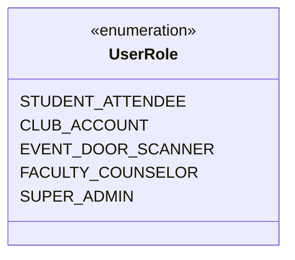
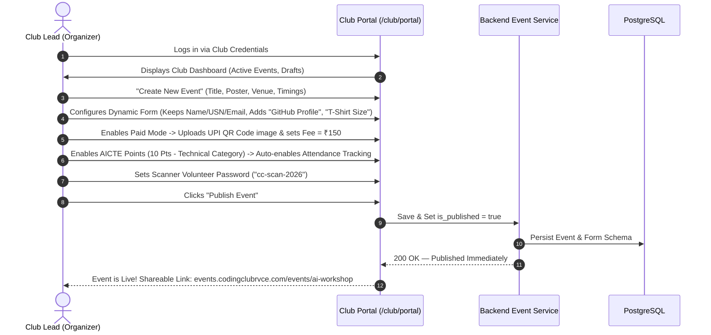
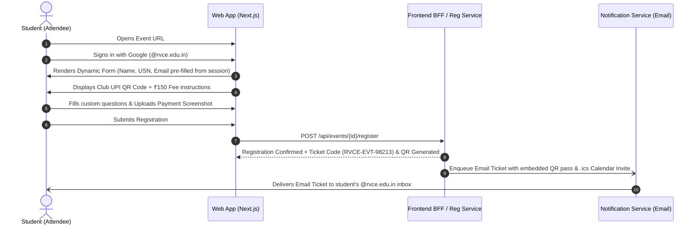
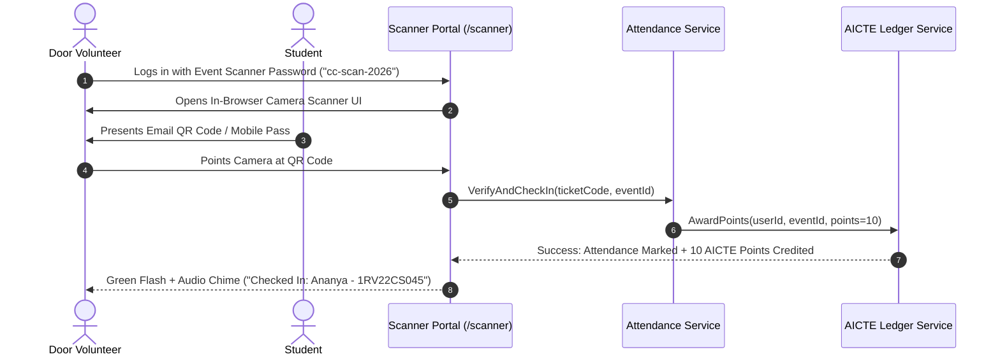
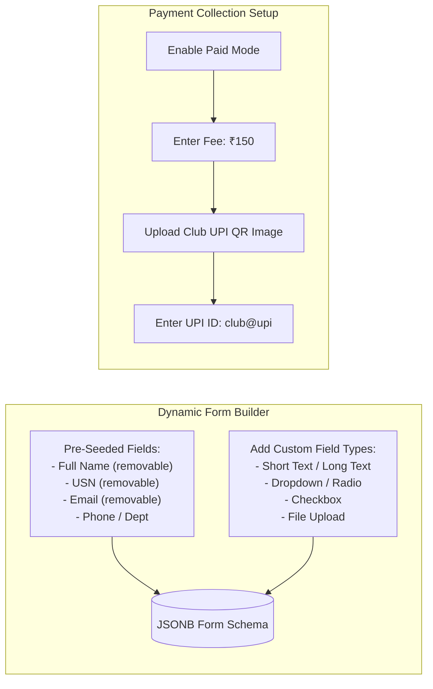
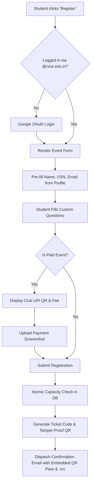
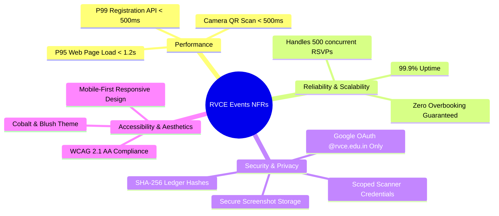
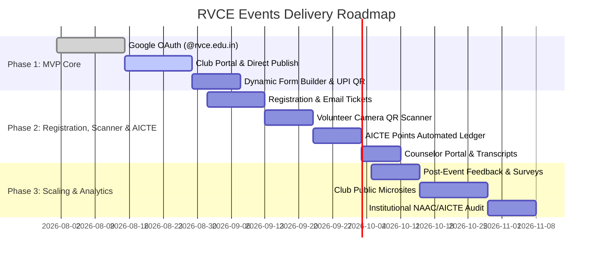

# RVCE Events — Product Requirements Document (PRD)

> **Document Status:** Active Specification  
> **Version:** 1.2.0 (Direct Club Publishing, Dynamic Forms, UPI Payments, Scanner Auth & AICTE Points)  
> **Target Release:** MVP (Phase 1 & Phase 2)  
> **Owner / Author:** Coding Club RVCE  
> **Target Audience:** Engineering, UI/UX Design, Club Leads, RVCE Administration & Student Affairs  
> **Live Staging:** `https://events.test.codingclubrvce.com` | **Production:** `https://events.codingclubrvce.com`  

---

## 1. Executive Summary & Problem Statement

### 1.1 Context & Background
R.V. College of Engineering (RVCE), Bengaluru hosts over 80+ student clubs, departmental associations, cultural bodies (8th Mile, Alaap, Footprints), and technical symposiums (Coding Club, IEEE, Rotaract, E-Cell). Every semester, dozens of technical workshops, community service drives, hackathons, and symposiums take place across campus.

Under AICTE / Autonomous RVCE degree guidelines, every undergraduate engineering student must accumulate **100 AICTE Activity Points** across their 4-year tenure (75 points for lateral entry) by participating in or organizing events with societal, technical, environmental, and community impact as a mandatory prerequisite for degree conferral.

### 1.2 The Problem
The current campus event ecosystem suffers from severe fragmentation, paper-heavy bureaucracy, and administrative overhead:
1. **Discovery Fragmentation:** Events are marketed haphazardly via WhatsApp broadcast lists, Instagram stories, and printed notice board posters. Students routinely miss high-value workshops, hackathons, and guest lectures due to the lack of a centralized schedule.
2. **Form Chaos & Lack of Customization:** Organizers rely on unmanaged Google Forms, leading to duplicate entries, manual spreadsheet maintenance, lack of automated capacity limits, and no automated ticketing.
3. **Payment Reconciliation Headaches:** For paid workshops, clubs manually check Google Pay/PhonePe screenshots sent over WhatsApp or Google Form uploads with zero automated validation or ticketing link.
4. **Check-In Bottlenecks:** On event day, long queues form at auditorium/lab entrances for manual paper roll calls or signature sheets, causing delays and inaccurate attendance figures.
5. **The AICTE Activity Points Bureaucracy:**
   - **Manual Report Generation:** Organizers compile physical lists of attendee USNs and claimed activity points.
   - **Physical Stamping Loop:** Organizers shuttle between Faculty Advisors, HODs, and the Principal's office to obtain physical signatures and ink stamps.
   - **Paper Loss & Verification Burden:** Physical stamped sheets are scanned into fuzzy PDFs or handed out as loose paper certificates. Students must preserve 4 years of paper receipts.
   - **Counselor/Proctor Friction:** During annual reviews, **Faculty Counselors / Proctors** must manually inspect dozens of loose paper certificates per student, leading to forged proofs, lost credits, and massive faculty time drain.

---

### 1.3 The Solution & Product Workflow

**RVCE Events** is an institution-wide, self-hosted web platform providing direct event publishing for clubs, dynamic form building, UPI payment verification, high-speed QR door scanning, automated AICTE point disbursement, and institutional student authentication.

```mermaid
flowchart TD
    subgraph ClubPortal ["1. Club Portal (Direct Publishing)"]
        ClubLogin[Club logs in with Club Credentials] --> CreateEvt[Create & Configure Event]
        CreateEvt --> FormBuild[Dynamic Form Builder: Pre-seeded Name/USN/Email + Custom Fields]
        CreateEvt --> PayConfig[Optional: Upload Club UPI QR Code & Fee]
        CreateEvt --> AICTEConfig[Optional: Enable AICTE Points -> Auto-enables Attendance]
        CreateEvt --> ScannerConfig[Set Event Volunteer / Scanner Password]
        CreateEvt --> DirectPub[1-Click Publish: Goes Live Instantly (No Approval Needed)]
    end

    subgraph StudentFlow ["2. Student Discovery & Registration"]
        DirectPub --> Catalog[Public Event Directory]
        Catalog --> StudentAuth[Student Signs in via Google OAuth @rvce.edu.in]
        StudentAuth --> FillForm[Fills Dynamic Form + Uploads Payment Screenshot if Paid]
        FillForm --> TicketGen[Ticket Generated + Instant Email with Embedded QR Pass]
    end

    subgraph DoorCheckIn ["3. Event Day High-Speed Door Check-In"]
        ScannerConfig -.-> VolLogin[Volunteers log in to /scanner with Event Password]
        TicketGen -.-> ShowQR[Student shows Mobile QR Pass]
        VolLogin --> ScanCam[Volunteer Scans QR via In-Browser Camera]
        ShowQR --> ScanCam
        ScanCam --> MarkAttend[Attendance Recorded in < 500ms]
        MarkAttend --> AutoAICTE[(Instant AICTE Point Ledger Credit)]
    end

    subgraph ProctorClearance ["4. Academic & Counselor Clearance"]
        AutoAICTE --> StudentLedger[Student AICTE Progress: 0-100 Pts Meter]
        StudentLedger --> TransPDF[1-Click Verified PDF Transcript with Verification QR]
        TransPDF --> ProctorVerify[Faculty Counselor Scans QR / Views Portal -> Clears Student]
    end
```

---

## 2. Product Objectives & Success Metrics

### 2.1 Core Objectives
- **Direct Club Autonomy:** Provide clubs with dedicated credentials to directly create and publish events without approval bottlenecks.
- **Dynamic Google Forms-Like Flexibility:** Allow organizers to configure registration questions (pre-populated with Name, USN, Email, plus custom text/dropdown/checkbox/file inputs).
- **Lightweight Payment Collection:** Enable clubs to upload UPI QR codes and collect transaction completion screenshots during registration.
- **Event-Scoped Volunteer Door Scanners:** Provide lightweight, event-specific passwords for door ushers to rapidly scan attendee QR passes without accessing administrative club settings.
- **Automated AICTE Activity Points Ledger:** Disburse points to student profiles the exact moment attendance is verified via QR scan, eliminating paper certificates.
- **Strict RVCE Institutional Authentication:** Restrict student sign-in strictly to `@rvce.edu.in` via Google OAuth.

### 2.2 Key Performance Indicators (KPIs)

| Metric | Baseline (Manual) | MVP Target | Mature State (1 Year) |
| --- | --- | --- | --- |
| **Centralized Event Coverage** | < 10% (isolated posters) | > 85% of campus events | > 98% of all campus events |
| **Active Verified Students** | 0 | 4,000+ `@rvce.edu.in` users | 9,000+ students & alumni |
| **Avg. Registration Time** | 2-3 mins (long external forms) | < 30 seconds (pre-filled fields) | < 15 seconds |
| **Door Check-in Throughput** | ~15-20 secs/person (paper) | < 2.0 secs/person (camera QR scan) | < 1.0 sec/person |
| **AICTE Point Disbursal Time** | 3–6 weeks (physical stamping) | **Instant (< 1 sec on check-in)** | **Instant (< 1 sec on check-in)** |
| **Counselor Audit Time per Student** | 15–30 mins (paper inspection) | **< 30 seconds (digital portal)** | **< 10 seconds (automated sync)** |
| **Platform Uptime & Reliability** | N/A | 99.9% uptime during fests | 99.95% uptime |

---

## 3. Target Personas & Access Roles



### 3.1 Persona Summary Matrix

| Role | Authentication Mechanism | Primary Capabilities | Target User |
| --- | --- | --- | --- |
| **Student / Attendee** | Google OAuth strictly restricted to `@rvce.edu.in` | Browse catalog, 1-click register with auto-filled profile (Name, USN, Email), upload payment screenshot, receive QR ticket via email, track 100 AICTE points. | *Ananya (2nd Year B.E. CS)* |
| **Club Account / Organizer** | Dedicated Club Username / Password (with Superadmin & self-reset) | Access hidden `/club/portal`, directly create and publish events, build dynamic registration forms, upload UPI QR code, manage attendee lists, set volunteer scanner passwords. | *Rohan (Club Head, Coding Club / Rotaract)* |
| **Event Door Scanner (Volunteer)** | Event-scoped Username & Password (set by Club) | Access `/scanner` to rapidly scan attendee QR codes with device camera and view live check-in counters. No access to club settings. | *Shreya (1st Year Event Usher / Volunteer)* |
| **Faculty Counselor / Proctor** | `@rvce.edu.in` Google Auth / Counselor Portal | Review assigned proctees' cumulative AICTE points progress, inspect itemized event history, 1-click approve semester graduation clearance. | *Dr. Sudha (Assistant Professor & Proctor)* |
| **Super Administrator** | Dedicated Admin Credentials | Provision club accounts, reset club passwords, manage campus venues/master categories, audit security logs. | *Coding Club RVCE Core Platform Team* |

---

## 4. User Journey Maps

### 4.1 Club Organizer Journey: Setup to Direct Publishing



### 4.2 Student Attendee Journey: Registration to Digital Ticket



### 4.3 Volunteer Scanner Journey: Door Check-In to AICTE Credit



---

## 5. Information Architecture & Core Domain Model

```mermaid
erDiagram
    CLUB ||--o{ EVENT : organizes
    EVENT ||--o{ REGISTRATION : receives
    USER ||--o{ REGISTRATION : places
    USER ||--o{ AICTE_POINT_LEDGER : earns
    REGISTRATION ||--o| ATTENDANCE_RECORD : checked_in_as
    ATTENDANCE_RECORD ||--o| AICTE_POINT_LEDGER : triggers
    CLUB ||--o{ AUDIT_LOG : generates

    CLUB {
        uuid id PK
        string slug UK "coding-club-rvce"
        string name
        string email UK "official club email for recovery"
        string password_hash
        string logo_url
        text description
        boolean is_active
        timestamp created_at
    }

    EVENT {
        uuid id PK
        uuid club_id FK
        string slug UK
        string title
        text description
        string cover_image_url
        string category
        boolean is_published
        string venue_name
        timestamp start_time
        timestamp end_time
        timestamp registration_deadline
        int capacity
        boolean waitlist_enabled
        boolean is_paid
        decimal fee_amount
        string upi_id
        string upi_qr_image_url
        boolean aicte_eligible
        int aicte_points
        enum aicte_category
        boolean attendance_required
        string scanner_username
        string scanner_password_hash
        jsonb form_schema "Dynamic Form Definitions (Fields, Types, Required)"
        timestamp created_at
    }

    USER {
        uuid id PK
        string email UK "@rvce.edu.in"
        string full_name
        string usn UK "1RV22CS045"
        string department
        int graduation_year
        uuid counselor_id FK
        enum role "STUDENT, COUNSELOR, SUPER_ADMIN"
    }

    REGISTRATION {
        uuid id PK
        uuid event_id FK
        uuid user_id FK
        string ticket_code UK "RVCE-EVT-XXXXXX"
        enum status "CONFIRMED, WAITLISTED, CANCELLED"
        jsonb form_responses "Attendee answers to dynamic form questions"
        string payment_screenshot_url
        enum payment_status "FREE, PENDING_VERIFICATION, VERIFIED, REJECTED"
        timestamp registered_at
    }

    ATTENDANCE_RECORD {
        uuid id PK
        uuid registration_id FK UK
        string checked_in_by "Scanner Username / Volunteer ID"
        timestamp checked_in_at
        enum check_in_method "CAMERA_QR_SCAN, MANUAL_FALLBACK"
    }

    AICTE_POINT_LEDGER {
        uuid id PK
        uuid user_id FK
        uuid event_id FK
        uuid attendance_record_id FK UK
        int points_awarded
        enum aicte_category
        timestamp awarded_at
        string verification_hash UK "SHA256 Hash"
    }
```

---

## 6. Detailed Functional Requirements (Epics & User Stories)

### Epic 1: Authentication & Access Boundaries

#### Overview
Establishes clean security separation: Students sign in via `@rvce.edu.in` Google OAuth, Clubs access the hidden management portal with dedicated club credentials, and Door Volunteers use event-scoped scanner credentials.

#### Requirements & Acceptance Criteria

| ID | Feature | Description | Acceptance Criteria | Priority |
| --- | --- | --- | --- | --- |
| **AUTH-01** | Exclusive RVCE Google OAuth (`@rvce.edu.in`) | Strictly enforce RVCE Google Workspace authentication for students and faculty. No login or registration is permitted for personal or non-RVCE email accounts. | - Google OAuth strictly validates the hosted domain (`hd: "rvce.edu.in"`).<br/>- Personal Gmail (`@gmail.com`) and external domains are immediately rejected with an explicit error screen.<br/>- Auto-extracts student name and verified institutional email from the Google ID token. | **P0 (Must Have)** |
| **AUTH-02** | Club Account Login & Portal Access | Dedicated `/club/login` portal for clubs, hidden from general public attendees. | - Clubs authenticate via username/slug and password.<br/>- Super Admins can provision club accounts and reset passwords.<br/>- Clubs can self-reset password via verified recovery email. | **P0 (Must Have)** |
| **AUTH-03** | Event Scanner Volunteer Authentication | Lightweight authentication for door ushers at `/scanner` using event-specific scanner passwords. | - Authenticates volunteer strictly for that specific event's QR scanning.<br/>- Volunteers cannot access club dashboard, edit event details, or view financial data. | **P0 (Must Have)** |
| **AUTH-04** | Student Profile & USN Mapping | First-time student login prompts for USN (regex validated `^1RV\d{2}[A-Z]{2}\d{3}$`), Department, and Year. | - USN uniqueness enforced across all student records.<br/>- Saved to user profile and auto-filled in subsequent event forms. | **P0 (Must Have)** |

---

### Epic 2: Club Workspace & Direct Event Publishing

#### Overview
Gives student clubs complete autonomy to create and publish events immediately without waiting for admin or faculty moderation queues.

#### Requirements & Acceptance Criteria

| ID | Feature | Description | Acceptance Criteria | Priority |
| --- | --- | --- | --- | --- |
| **CLUB-01** | Club Dashboard Hub | Authenticated dashboard (`/club/portal`) displaying active events, drafts, attendee counts, and quick actions. | - Shows real-time attendee counts and payment verification queues. | **P0 (Must Have)** |
| **CLUB-02** | Direct Event Publishing | 1-click "Publish" immediately publishes the event to the public catalog. No external approval required. | - Instant indexation on the public `/events` directory.<br/>- Direct public shareable URL generated (`events.codingclubrvce.com/events/{slug}`). | **P0 (Must Have)** |
| **CLUB-03** | Event Lifecycle Management | Organizers can update event details, close registration early, or cancel events with an attendee broadcast reason. | - Major field changes (venue/time) automatically trigger email notices to registered attendees. | **P0 (Must Have)** |
| **CLUB-04** | Scanner Password Configuration | Inside each event management tab, clubs can view or customize the Event Scanner Password (e.g., `cc-volunteer-pass`) given to door ushers. | - Password can be updated anytime before or during the event. | **P0 (Must Have)** |

---

### Epic 3: Dynamic Form Builder & UPI Payment Configuration

#### Overview
A Google Forms-like customizable form builder and lightweight UPI payment collection system built directly into event creation.



#### Requirements & Acceptance Criteria

| ID | Feature | Description | Acceptance Criteria | Priority |
| --- | --- | --- | --- | --- |
| **FORM-01** | Pre-Seeded Default Fields | Event form builder automatically pre-populates default fields: **Full Name, USN, Email Address**, and optional Phone/Department. | - Organizers can toggle **Remove** or **Keep** on any default field.<br/>- Default fields automatically pre-fill on student registration from their Google profile. | **P0 (Must Have)** |
| **FORM-02** | Google Forms-Like Custom Inputs | Organizers can add unlimited custom fields: Short Text, Long Paragraph, Dropdown, Radio Options, Multi-select Checkboxes, and File Upload (e.g. Resume, GitHub link, PDF). | - Organizers can mark fields as **Required** or **Optional**.<br/>- Stored as structured `form_schema` JSONB. | **P0 (Must Have)** |
| **FORM-03** | UPI QR Code & Fee Configuration | For paid events, organizers toggle "Paid Event", input Fee Amount (INR), enter UPI ID, and upload their UPI QR code image. | - Displayed prominently to attendees during registration checkout. | **P0 (Must Have)** |
| **FORM-04** | Payment Screenshot Upload by Attendees | For paid events, the registration form requires attendees to upload their payment completion screenshot (+ optional UTR/Transaction ID). | - Image compressed and securely stored on server storage.<br/>- Registration marked as `PENDING_VERIFICATION` or `CONFIRMED` with screenshot badge. | **P0 (Must Have)** |
| **FORM-05** | Organizer Payment Verification Queue | Club organizers can view submitted payment screenshots in the attendee list and 1-click **Verify** or **Reject** registrations. | - Rejecting a payment releases the capacity seat and notifies the student. | **P1 (Should Have)** |

---

### Epic 4: Public Event Catalog & Discovery

#### Overview
A lightning-fast, visually stunning public directory reflecting the official RVCE Cobalt (`#4a32f9`) & Blush (`#fdcdd7`) brand aesthetics.

#### Requirements & Acceptance Criteria

| ID | Feature | Description | Acceptance Criteria | Priority |
| --- | --- | --- | --- | --- |
| **DISC-01** | Public Directory & AICTE Badges | Public grid of published events at `/events` with category chips, dates, venues, fee badges (Free / ₹XX), and "AICTE Eligible: X Pts" badges. | - Space Grotesk badges and Cobalt/Blush brand styling. | **P0 (Must Have)** |
| **DISC-02** | Instant Search & Filter Engine | Search by event title, organizer club, tags, or description; filter by "AICTE Points Eligible", Free/Paid, Category, Date, and Venue. | - Debounced client-side search (< 100ms response).<br/>- URL query parameters synchronized (`/events?aicte=true&paid=false`). | **P0 (Must Have)** |
| **DISC-03** | Shareable Social Cards (OpenGraph) | Dynamic OpenGraph meta tags generating rich preview cards when links are shared on WhatsApp, LinkedIn, or Twitter. | - Dynamic preview image with event title, date, venue, fee, and RVCE Events logo. | **P1 (Should Have)** |
| **DISC-04** | Add-to-Calendar (.ics) | 1-click button on event detail page and email confirmation to add event directly to Google / Apple / Outlook Calendar. | - Generated standard `.ics` file containing exact start/end time, venue, and link. | **P0 (Must Have)** |

---

### Epic 5: Registration & Automated Email Ticketing

#### Overview
Seamless dynamic form submission, concurrency-safe capacity allocation, and instant automated email delivery with embedded QR tickets.



#### Requirements & Acceptance Criteria

| ID | Feature | Description | Acceptance Criteria | Priority |
| --- | --- | --- | --- | --- |
| **REG-01** | Dynamic Form Submission & Pre-fill | Renders the event's exact custom form schema with default profile fields pre-filled. | - Validates all required fields client-side and server-side.<br/>- Submits in < 300ms. | **P0 (Must Have)** |
| **REG-02** | Atomic Capacity Locking | High-concurrency seat reservation preventing overselling during rush registrations. | - Guaranteed zero overselling via row-level locks / transactional updates.<br/>- Tested for 500 concurrent registration requests. | **P0 (Must Have)** |
| **REG-03** | Instant Email Delivery with QR Pass | Immediately sends confirmation email to the student's `@rvce.edu.in` Gmail inbox containing the event summary, calendar `.ics`, and high-contrast digital QR pass. | - Email dispatch triggered asynchronously via transactional outbox.<br/>- Deliverability SLA: < 60 seconds from registration. | **P0 (Must Have)** |
| **REG-04** | My Registrations Dashboard | Students can view upcoming and past tickets in their dashboard (`/my-tickets`), access mobile QR passes offline, or cancel registrations. | - Cancelling releases capacity immediately. | **P0 (Must Have)** |

---

### Epic 6: Dedicated Volunteer Door Scanner & Attendance Engine

#### Overview
Enables door ushers to log in with event-specific scanner passwords and rapidly scan attendee QR codes with device cameras in under 2 seconds.

#### Requirements & Acceptance Criteria

| ID | Feature | Description | Acceptance Criteria | Priority |
| --- | --- | --- | --- | --- |
| **SCAN-01** | Volunteer Scanner Portal (`/scanner`) | Clean, mobile-optimized portal where volunteers enter the Event Scanner Password to open the active camera scanner. | - No club admin access or financial views exposed to volunteers. | **P0 (Must Have)** |
| **SCAN-02** | Fast Camera QR Scanning | Real-time camera feed scanning of digital ticket QR codes. | - Scan latency < 500ms.<br/>- Distinct feedback: Green screen flash + success chime for valid scan; Red flash + buzzer for duplicate/invalid scan. | **P0 (Must Have)** |
| **SCAN-03** | Duplicate Scan Prevention | Scanning a previously checked-in ticket alerts "Already Checked In at [Time] by [Volunteer]". | - Prevents duplicate entry or ticket sharing. | **P0 (Must Have)** |
| **SCAN-04** | Manual USN Search Fallback | If a student's phone battery dies, volunteers can search attendee by USN/Name and 1-click mark attendance. | - Action logged with timestamp and scanner identifier. | **P0 (Must Have)** |
| **SCAN-05** | Live Attendance Counter | Displays real-time live counter: "Checked In: 145 / 200 (72.5%)" with instant search for present vs absent attendees. | - Updates dynamically as volunteers scan. | **P0 (Must Have)** |

---

### Epic 7: AICTE Activity Points Automated Ledger & Proctor Verification

#### Overview
Completely replaces physical paper reports, signatures, and stamps with an automated, immutable digital ledger of AICTE Activity Points tied directly to verified QR attendance.

```mermaid
flowchart TD
    DoorScan[QR Code Scanned by Volunteer] --> AttendMarked[Attendance Recorded]
    AttendMarked --> AICTECheck{Is Event AICTE Eligible?}
    AICTECheck -- No --> Finish[Attendance Done (0 Points)]
    AICTECheck -- Yes --> AutoDisburse[Disburse Approved AICTE Points to Student Ledger]
    AutoDisburse --> GenHash[Generate Immutable SHA-256 Verification Hash]
    GenHash --> UpdateBalance[Update Student Cumulative Balance: e.g. 55 / 100 Pts]
    UpdateBalance --> PushAlert[Email & In-App Alert: '+10 AICTE Points Earned!']
    UpdateBalance --> Transcript[Included in 1-Click Digitally Signed Transcript PDF]
```

#### Requirements & Acceptance Criteria

| ID | Feature | Description | Acceptance Criteria | Priority |
| --- | --- | --- | --- | --- |
| **AICTE-01** | Auto-Disbursement on Attendance | When an attendee's QR ticket is scanned and marked `ATTENDED`, the system instantly credits the event's AICTE points to the student's ledger. | - Credit operation is atomic and idempotent.<br/>- Generates a unique SHA-256 verification hash per credit entry. | **P0 (Must Have)** |
| **AICTE-02** | Auto-Enabling Attendance Dependency | In the club event creation form, enabling "AICTE Points" automatically toggles on and locks the **Attendance Tracking** requirement. | - Points cannot be awarded without verified check-in. | **P0 (Must Have)** |
| **AICTE-03** | Student AICTE Portfolio | Dedicated student dashboard (`/profile/aicte`) displaying total points accumulated (e.g. `65 / 100 Pts`), 0-100 progress bar, and categorized breakdown. | - Itemized ledger listing each event, date, club, and points awarded. | **P0 (Must Have)** |
| **AICTE-04** | Digitally Signed AICTE Transcript (PDF) | Students can generate and download an official, tamper-proof "AICTE Activity Points Transcript" with an embedded verification QR code. | - PDF contains student name, USN, department, semester-by-semester breakdown, and official RVCE / Coding Club digital seal.<br/>- Scanning the QR navigates to `events.codingclubrvce.com/verify/transcript/{hash}` confirming authenticity. | **P0 (Must Have)** |
| **AICTE-05** | Faculty Counselor / Proctor Portal | Dedicated dashboard for Faculty Counselors (`/counselor/dashboard`) listing their assigned proctees with live AICTE points progress. | - Proctors can view any proctee's itemized event history with 1 click.<br/>- 1-click "Approve / Clear AICTE Requirement" toggle for final semester graduation submission. | **P0 (Must Have)** |
| **AICTE-06** | 1-Click AICTE Compliance Export | Club organizers can export an official, formatted AICTE Event Report with 1 click after event completion. | - Export includes event title, date, venue, attendee list with USNs, check-in timestamps, and points awarded. | **P0 (Must Have)** |

---

### Epic 8: Super Administrator Governance

#### Overview
Platform-wide administration, club credential provisioning, venue management, and security auditing.

#### Requirements & Acceptance Criteria

| ID | Feature | Description | Acceptance Criteria | Priority |
| --- | --- | --- | --- | --- |
| **ADM-01** | Club Provisioning & Password Management | Super Admins can create new club accounts (slug, name, recovery email, initial password) and trigger password resets. | - Super Admins can suspend or reactivate club accounts. | **P0 (Must Have)** |
| **ADM-02** | Master Venue & Category Management | Add/edit approved campus venues (e.g., IEM Auditorium, CS Seminar Hall, Library Media Lab) and event categories. | - Provides standard venue dropdown for clubs. | **P1 (Should Have)** |
| **ADM-03** | Immutable Audit Trail | Structured logs tracking critical actions: Club Password Resets, Event Cancellations, AICTE Point Adjustments, Manual Attendance Overrides. | - Captures `timestamp`, `actor_user_id`, `action`, `target_entity_id`, and `ip_address`. | **P0 (Must Have)** |

---

## 7. Non-Functional Requirements (NFRs)



### 7.1 Performance & Latency
- **Public Catalog:** Initial page load (LCP) < 1.2s on 4G mobile connections. Server-side rendering (SSR) via Next.js for fast initial paint.
- **Registration Throughput:** Peak load handling of up to 500 concurrent registration requests with P99 response time < 500ms.
- **QR Scan & AICTE Point Award:** Combined latency from camera decode to attendance record commit and AICTE ledger credit < 500ms.

### 7.2 Reliability & Fault Tolerance
- **Transactional Consistency:** ACID transactions for registration capacity and AICTE ledger entries.
- **Asynchronous Decoupling:** Email delivery and background tasks must use a durable transactional outbox pattern so mail server delays never block check-ins or registrations.
- **Data Persistence:** Automated daily PostgreSQL backups with point-in-time recovery.

### 7.3 Security & Academic Integrity
- **Tamper-Proof Ledger:** Each AICTE point disbursement is cryptographically hashed with `SHA256(user_id + event_id + points + timestamp + secret_salt)`.
- **Public Verification Route:** Anyone scanning the QR code on a student's downloaded transcript is taken to `events.codingclubrvce.com/verify/transcript/{hash}` which validates against the database in real time.
- **Scoped Scanner Auth:** Door ushers only get check-in capability for the specific event, with zero access to club finances, attendee personal contact details, or event settings.

### 7.4 Usability & Design System
- Strictly adhere to the **RVCE Events Design System**:
  - Primary Background: Cobalt (`--bg-cobalt` / `#4a32f9`)
  - Primary Accent/Text: Blush (`--text-blush` / `#fdcdd7`)
  - Typography: Aalto Display for hero typography, Inter for UI, Space Grotesk for badges, AICTE points, and ticket codes.
- Mobile-First design: 85%+ of student interactions (browsing, registering, uploading payment screenshots, displaying tickets, scanning at doors) happen on smartphones.

---

## 8. Release Roadmap & Implementation Milestones



### Phase 1: MVP Core (Weeks 1–4)
- Student Authentication via Google OAuth strictly restricted to `@rvce.edu.in`.
- Club Account Authentication & Hidden Club Portal (`/club/portal`).
- Direct Event Creation & Instant Publishing (no admin approval queue).
- Dynamic Form Builder (Default pre-seeded Name/USN/Email + custom inputs).
- UPI QR Code upload and payment screenshot attachment.
- Public Event Directory with search and AICTE filters.

### Phase 2: High-Speed Operations & AICTE Automation (Weeks 5–7)
- Concurrency-safe Registration and Automated Email Ticket Delivery with QR pass.
- Event Scanner Volunteer Portal (`/scanner`) with camera QR scanning.
- **Automated AICTE Point Disbursement** upon verified attendance scan.
- **Student AICTE Points Portfolio & Progress Tracker** (0 to 100 points meter).
- **Digitally Signed AICTE Transcript (PDF)** with QR verification.
- **Faculty Counselor / Proctor Portal** for 1-click proctee clearance.

### Phase 3: Engagement & Institutional Scaling (Weeks 8–10)
- Automated Post-Event Feedback & Rating collection.
- Club Public Microsites (`/clubs/{slug}`).
- Multi-day / Multi-session Event Agenda builder.
- Institutional AICTE / NAAC Accreditation compliance analytics dashboard.

---

## 9. Document Revision History

| Version | Date | Author | Summary of Changes |
| --- | --- | --- | --- |
| `1.0.0-draft` | 2026-08-16 | Coding Club RVCE | Initial PRD drafted from `FEATURES.md` and `SYSTEM_DESIGN.md`. |
| `1.1.0-draft` | 2026-08-16 | Coding Club RVCE | Added comprehensive AICTE Activity Points Automated Ledger & Counselor Portal. |
| `1.2.0` | 2026-08-16 | Coding Club RVCE | Updated to **Direct Club Publishing** (no admin approval), **Dynamic Form Builder** (pre-seeded & custom inputs), **UPI QR Payments & Screenshot Upload**, **Event Scanner Volunteer Passwords**, and **Strict `@rvce.edu.in` Google Auth**. |
